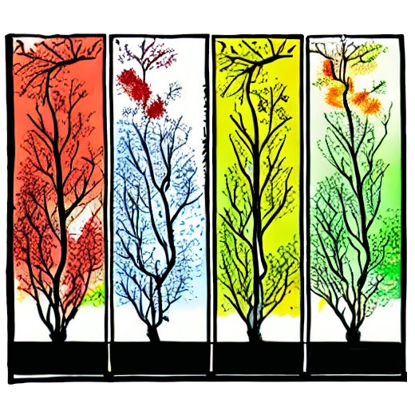

# HDV-Season



<blockquote>
    <p>
        ‘‘ Developers stay home and then forget the season.
    </p>
    <p align="right">
        A random president
    </p>
</blockquote>
<br>

## Summary
HCV-Season is a library provides color changes according to season, like red as summar, blue as winter, brown as autumn, green as spring. Seasonal colors are customizable.

## Installation
```
npm i hcv-season
```

## Usage
### Page alteration
```javascript
// reflect current season to page
const season = require("hcv-season");
const props = [ "background-color",  "border-color", "color" ];
const config = { today: new Date(), impact: 0.1 };
season.reflectToPage(props, config);
```

### Element alteration
```javascript
// reflect current season to single element
const ele = document.getElementById("something");
const season = require("hcv-season");
const props = [ "background-color",  "border-color", "color" ];
const config = { today: new Date(), impact: 0.1 };
season.reflectToElement(ele, props, config);
```

### Color alteration
```javascript
// reflect current season to color
const season = require("hcv-season");
const config = { today: new Date(), impact: 0.1 };
const color = season.getReflectionColor("#333333");
```